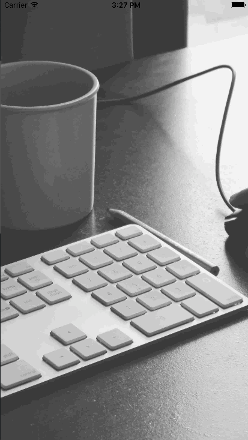
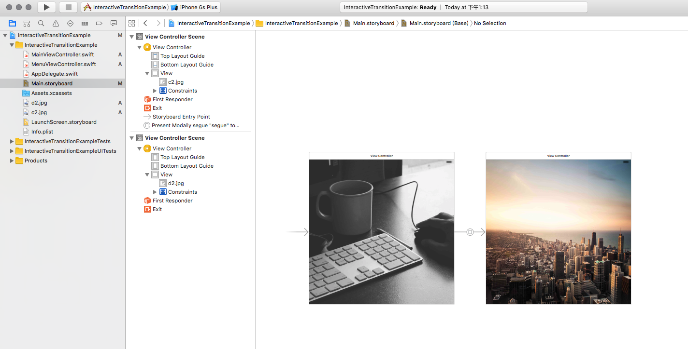
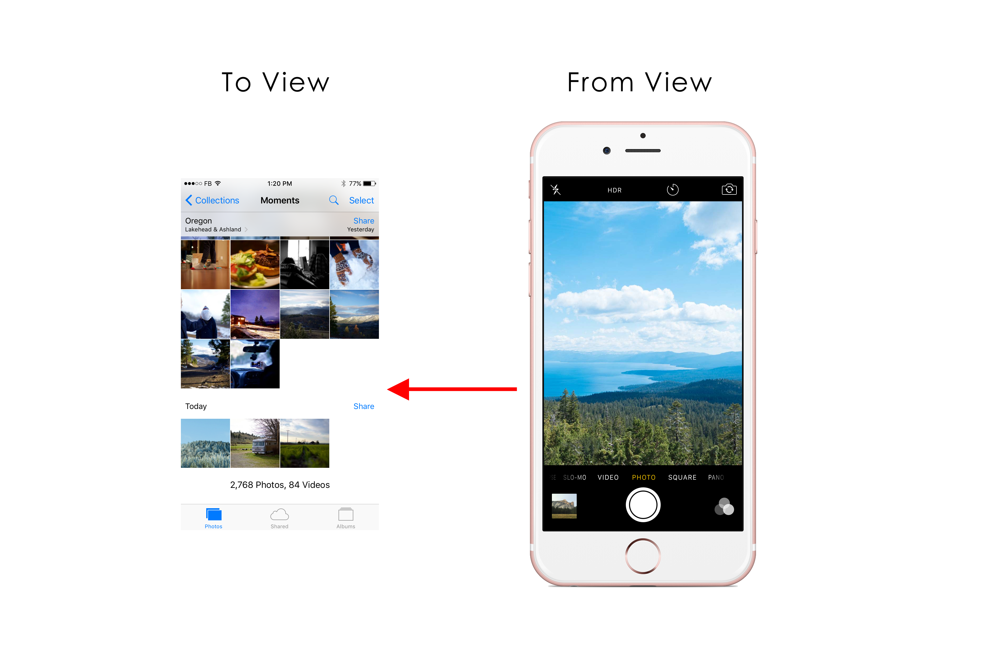

Controller 之間的轉場動畫

結果圖：



完成的[專案檔](https://github.com/yoxisem544/InteractiveTransitionExample)

## 開始之前
可能要先知道 `UIViewControllerTransitioningDelegate` 跟 `UIViewControllerAnimatedTransitioning` 是什麼

（這邊我會再補一篇來說說這兩個Protocol是做什麼的）

## 你有沒有想過
怎麼做出像是 Facebook Slack 左右滑動時就可以叫出不同的 Controller？還有像是 Apple 原生的 Photo App，點擊照片，照片會放大顯示，然後轉換到另外一個 Controller？

## 要做什麼？
這邊我想做出一個可以顯示出測邊欄的效果，測邊欄會從左邊進入，在進入的同時，他會有一種原本是沈在畫面底下，進而往上浮的感覺。

## 準備開始
### 準備 Project
這邊簡單的步驟我就不贅述了，這邊我們需要你開一個新的 Project，需要在 `Storyboard` 中拉兩個 `ViewController`，然後一個命名為 `MainViewController` 另一個命為 `MenuViewController`。

中間連結一個 `segue`，型態為 `Present Modally`，這邊我把他命名為 `segue` 當成他的 `identifier`。

類似：


這邊我已經先把 `ImageView` 放上去了。這邊可以放你喜歡的圖片。

### 建立 TransitionManager
`cmd+N`建立一個新的 File。這邊我把他命名為 `TransitionManager`。

我們要先讓他 conform `UIPercentDrivenInteractiveTransition` 這個 protocol。

```swift
import Foundation
import UIKit

class TransitionManager: UIPercentDrivenInteractiveTransition {

}
```

然後我們用 `extension` 的方式讓他 conform `UIViewControllerTransitioningDelegate` 跟 `UIViewControllerAnimatedTransitioning`，這兩個 protocol。

```swift
import Foundation
import UIKit

class TransitionManager: UIPercentDrivenInteractiveTransition {

}

extension TransitionManager : UIViewControllerTransitioningDelegate {

}

extension TransitionManager : UIViewControllerAnimatedTransitioning {

}
```

### Flag
這邊的 Flag 是為了方便在 dismiss 或者 present 時判斷用的。

這邊我們需要兩個 Flag 去幫我們做判斷：
1. isPresenting
2. isInteractive

把這兩個 Flag 加入 class 中，初始值都 `false`：

```swift
class TransitionManager: UIPercentDrivenInteractiveTransition {
	var isPresenting: Bool = false
	var isInteractive: Bool = false
}
```

### UIViewControllerTransitioningDelegate
這個 protocol 會幫我們處理 VC 轉場時會遇到的很多麻煩事情。這邊我們需要 conform 幾個需要 implement 的 methods。

1. interactionControllerForDismissal: 在 dismiss 時會幫我們判對是否是以 interactive 的方式去動作
2. interactionControllerForPresentation: 跟上面一樣，但發生在 presentation 時。
3. animationControllerForDismissedController: （好像是動畫？）
4. animationControllerForPresentedController

在轉場一被觸發時，會先執行 `interactionControllerFor XXX` 跟 `animationControllerFor XXX`。

如果轉場是被手勢觸發的話，我們要在 `interactionControllerFor XXX` 回傳 `self`，否則 `nil`。

第二件事情就是 `animationControllerFor XXX`，如果今天被觸發的是 `animationControllerForPresentedController`，我們需要把 `isPresenting` 標記為 `true`，表示現在正準備 show 出第二個畫面。如果今天被觸發的是 `animationControllerForDismissedController`，則標記為 `false`。

然後需要回傳 `self`

```swift
extension TransitionManager : UIViewControllerTransitioningDelegate {

	func animationControllerForPresentedController(presented: UIViewController, presentingController presenting: UIViewController, sourceController source: UIViewController) -> UIViewControllerAnimatedTransitioning? {
		isPresenting = true
		return self
	}

	func animationControllerForDismissedController(dismissed: UIViewController) -> UIViewControllerAnimatedTransitioning? {
		isPresenting = false
		return self
	}

	func interactionControllerForPresentation(animator: UIViewControllerAnimatedTransitioning) -> UIViewControllerInteractiveTransitioning? {
		return isInteractive ? self : nil
	}

	func interactionControllerForDismissal(animator: UIViewControllerAnimatedTransitioning) -> UIViewControllerInteractiveTransitioning? {
		return isInteractive ? self : nil
	}
}
```
### UIViewControllerAnimatedTransitioning
這個 protocol 可以幫我們處理動畫的部份

只要給 Initial State 跟 End State，其他的這個 protocol 會幫我們處理完。

這邊需要 conform 2個 protocol methods：
1. transitionDuration：只要給動畫的時間就好
2. animateTransition：這邊給 Initial State 跟 End State 他就會幫我們處理完所有的事情

暫時放著：

```swift
extension TransitionManager : UIViewControllerAnimatedTransitioning {

	func transitionDuration(transitionContext: UIViewControllerContextTransitioning?) -> NSTimeInterval {
		return 0.5
	}

	func animateTransition(transitionContext: UIViewControllerContextTransitioning) {
		// TODO: 處理動畫
	}
}
```

### 加入手勢
這邊我們要開始處理手勢了，`UIPercentDrivenInteractiveTransition` 會根據你給的百分比去調整動畫的位置。

所以我們要根據手勢的位移，來算出這個動畫該移動到什麼位置。

這邊我們要在 `Manager` 中加入兩個變數 `mainViewController` 跟 `menuViewController`，而且我們要在他 `didSet` 時，讓他們同時可以處理 pan gseture。

```swift
class TransitionManager: UIPercentDrivenInteractiveTransition {
	var isPresenting: Bool = false
	var isInteractive: Bool = false

	var mainPanGesture: UIPanGestureRecognizer!
	var mainViewController: MainViewController! {
		didSet {
			mainPanGesture = UIPanGestureRecognizer()
			mainPanGesture.addTarget(self, action: #selector(handleMainPanGesture))
			mainViewController.view.addGestureRecognizer(mainPanGesture)
		}
	}

	func handleMainPanGesture(gesture: UIPanGestureRecognizer) {

	}

	var menuPanGesture: UIPanGestureRecognizer!
	var menuViewController: MenuViewController! {
		didSet {
			menuPanGesture = UIPanGestureRecognizer()
			menuPanGesture.addTarget(self, action: #selector(handleMenuPanGesture))
			menuViewController.view.addGestureRecognizer(menuPanGesture)
		}
	}

	func handleMenuPanGesture(gesture: UIPanGestureRecognizer) {

	}
}
```
### 處理手勢
這邊要開始結合 `UIPercentDrivenInteractiveTransition` 這個 protocol 了。
我們一開始要先根據這個手勢移動的距離，算出我們所要的 progress，然後根據這個 progress，去 update 畫面。

`UIPercentDrivenInteractiveTransition` 提供了我們三個 method 去更新畫面：
1. updateInteractiveTransition
2. cancelInteractiveTransition
3. finishInteractiveTransition

手勢的部份我們一共有三個部份要處理：

首先：我們在手勢 `Began` 時，我們要把 `isInteractive` 變成 `true`，讓上面的 protocol 可以抓到，這樣的動畫就會是可以 "互動" 的了。

接著，在 `Changed` 時，我們根據 `progress` 去更新我們的畫面。

最後，如果手勢結束了，我們要看 `progress` 現在是不是超過我們所期望他轉場的值。以下我設定為超過 0.5 就要完成動畫，否則取消動畫。並且把 `isInteractive` 變成 `false`。

是不是很直覺？

```swift
func handleMainPanGesture(gesture: UIPanGestureRecognizer) {

	let translation = gesture.translationInView(gesture.view!)

	let progress: CGFloat = translation.x / 350.0

	switch gesture.state {
	case .Began:
		isInteractive = true
		mainViewController.performSegueWithIdentifier("segue", sender: nil)
	case .Changed:
		updateInteractiveTransition(progress)
	default:
		isInteractive = false
		if progress >= 0.5 {
			finishInteractiveTransition()
		} else {
			cancelInteractiveTransition()
		}
	}
}
```

回來的動畫也相似，這邊我不多說。

差別在方向，還有一開始是performSegue，現在變成dismiss。

```swift
func handleMenuPanGesture(gesture: UIPanGestureRecognizer) {

	let translation = gesture.translationInView(gesture.view!)

	let progress: CGFloat = -translation.x / 350.0

	switch gesture.state {
	case .Began:
		isInteractive = true
		menuViewController.dismissViewControllerAnimated(true, completion: nil)
	case .Changed:
		updateInteractiveTransition(progress)
	default:
		isInteractive = false
		if progress >= 0.5 {
			finishInteractiveTransition()
		} else {
			cancelInteractiveTransition()
		}
	}
}
```
### 準備處理動畫
終於到了處理動畫的部份了，我寫的好累QAQ。

這邊要先把我們需要的畫面都拿出來，才開始做動畫。

一開始我們會需要一個裝畫面的container，container會在動畫的時候出現，我們可以對我們的 to 跟 from view，作一些我們所想要的動畫。container會在動畫結束時不見，所有在上面的畫面將會消失，所以不管我們現在到底在哪裡，在最後動畫完成的時候，記得要把 view 加回 `UIApplication.sharedApplication().keyWindow`。**很重要！！**

(解釋from to view)
這邊先解釋一下 from view 跟 to view 到底是什麼。在畫面開始轉場的時候，我們現在所在的畫面就是 from view，我們即將到達的畫面叫 to view。

圖解：


```swift
func animateTransition(transitionContext: UIViewControllerContextTransitioning) {

	let container = transitionContext.containerView()!

	let screen: (from: UIViewController, to: UIViewController) = (transitionContext.viewControllerForKey(UITransitionContextFromViewControllerKey)!, transitionContext.viewControllerForKey(UITransitionContextToViewControllerKey)!)

	let menuVC = !isPresenting ? screen.from as! MenuViewController : screen.to as! MenuViewController
	let mainVC = !isPresenting ? screen.to as! MainViewController : screen.from as! MainViewController

	let mainVCSnapshot = mainVC.view.resizableSnapshotViewFromRect(mainVC.view.frame, afterScreenUpdates: true, withCapInsets: UIEdgeInsetsZero)

	container.addSubview(menuVC.view)
	container.addSubview(mainVC.view)

	let duration = transitionDuration(transitionContext)

	// TODO: Initial state


	UIView.animateWithDuration(duration, animations: {
		// TODO: animation code
		}) { (finished) in
			// TODO: finish or cancel code
	}
}
```

這邊我們先準備一個 screen 幫我們先取得 from 跟 to view，方便之後取用。

然後再要動畫之前，我們要在 container 上放上我們要做動畫的 from 跟 to view。

### 處理動畫
我們需要兩個狀態 Initial 跟 End state，只要定義好這兩個狀態，其他的我們就不用管了。

我們先處理 menu 還沒有顯示的狀態，一開始他在還沒有顯示的時候，應該是在螢幕左邊的地方，且要往下沈一點。

offStage可以幫我處理移動的位置。

```swift
func offStage(amount: CGFloat) -> CGAffineTransform {
	return CGAffineTransformMakeTranslation(amount, 0)
}

func offStageMenuViewControllerTransition(menuVC: MenuViewController) {
	menuVC.view.alpha = 0.0
	menuVC.view.transform = CGAffineTransformScale(offStage(-50), 0.9, 0.9)
}
```

接著是顯示的時候，menu 需要回到原本的位置。

```swift
func onStageMenuViewControllerTransition(menuVC: MenuViewController) {
	menuVC.view.alpha = 1.0
	menuVC.view.transform = CGAffineTransformIdentity
}
```

好的，定義好前後的動畫之後，我們就可以開始執行我們的動畫了！

在動畫要開始時，我們要先確定這個畫面是不是要顯示 menu，如果是的話，我們就要先把 menu 移動到 offStage 的地方。

```swift
// TODO: Initial state
if isPresenting {
	offStageMenuViewControllerTransition(menuVC)
}
```

然後開始動畫的時候也要先判斷是即將顯示還是即將回到原本的畫面。

如果是即將顯示 menu，那我們就要將 main 移動到右邊。menu 移動到 onStage 之處。

如果是要回到 main，那就要再次將 menu 移動到 offStage 的地方。main 回到原本的位置。

```swift
UIView.animateWithDuration(duration, animations: {
	if self.isPresenting {
		mainVC.view.transform = self.offStage(350)
		self.onStageMenuViewControllerTransition(menuVC)
	} else {
		mainVC.view.transform = CGAffineTransformIdentity
		self.offStageMenuViewControllerTransition(menuVC)
	}
	}) { (finished) in

		if transitionContext.transitionWasCancelled() {
			transitionContext.completeTransition(false)
			UIApplication.sharedApplication().keyWindow?.addSubview(screen.from.view)
		} else {
			transitionContext.completeTransition(true)
			UIApplication.sharedApplication().keyWindow?.addSubview(screen.to.view)
			if self.isPresenting {
				mainVCSnapshot.transform = self.offStage(350)
				screen.to.view.addSubview(mainVCSnapshot)
			}
		}
}
```

而在完成動畫時，我們要先判斷這個動畫是不是被我們取消了還是真的完成了。

如果今天這個動會被取消了，我們需要告訴 `transitionContext` 這個動畫沒有完成 `transitionContext.completeTransition(false)`。

且要在 keyWindow 加入 from view，不然整個螢幕會變黑。因為原本的container已經消失了。

如果今天這個動畫完成了，那就是 `transitionContext.completeTransition(true)`。
而且我們希望 main 留有一點點的畫面在 menu 的右邊，所以我們會在 to view 這邊再加上一層 main 的 snapshot。

### 回到兩個ViewController
在 main，我們要設定我們剛剛的 manager 給兩個畫面。
需要設定兩個viewcontroller，在 didSet 裡面會有 pan gesture 幫我們建立好。
設定 menu 的 `transitioningDelegate`。

然後就大功告成啦。

以下：

```swfit
import UIKit

class MainViewController: UIViewController {

	let manager = TransitionManager()

    override func viewDidLoad() {
        super.viewDidLoad()

        // Do any additional setup after loading the view.
		manager.mainViewController = self
    }

	override func prepareForSegue(segue: UIStoryboardSegue, sender: AnyObject?) {
		let vc = segue.destinationViewController as! MenuViewController
		vc.transitioningDelegate = manager
		manager.menuViewController = vc
	}
}
```

結果：


參考：

[dativestudios.com/blog](http://dativestudios.com/blog/2013/09/29/interactive-transitions/)

[mathewsanders.com](http://mathewsanders.com/interactive-transitions-in-swift)

[zappdesigntemplates.com](http://zappdesigntemplates.com/custom-uiviewcontroller-transition-ios-swift/)
